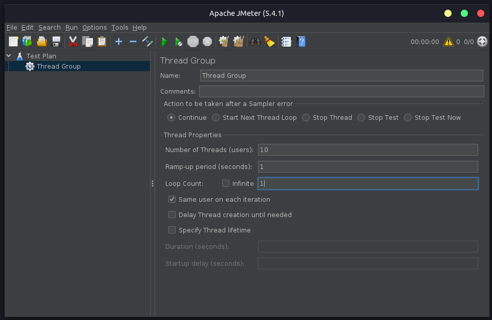
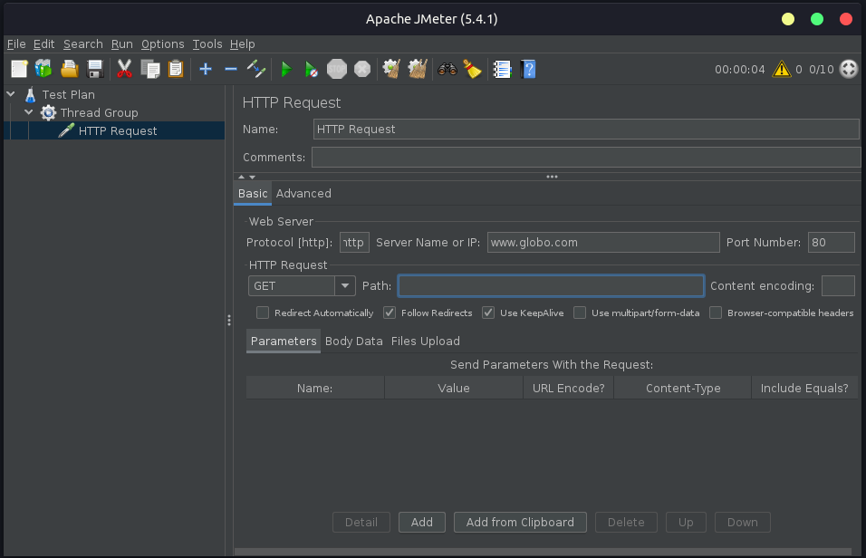
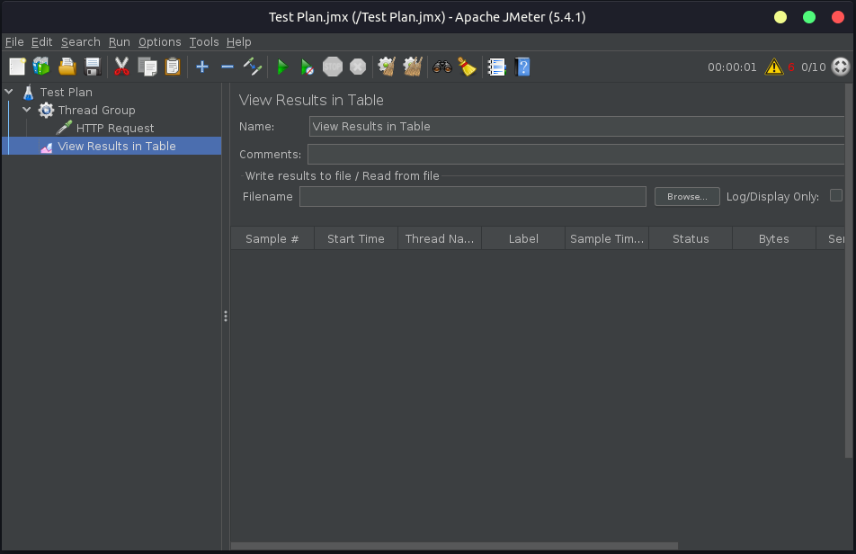
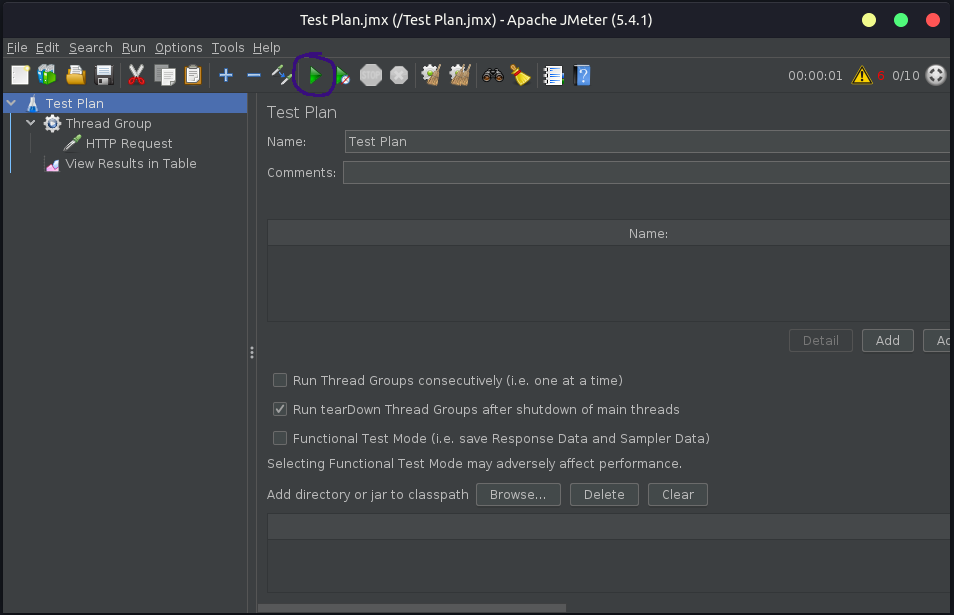

### Atividade de testes

A atividade faz parte da disciplina **Testes de Software** ministrada pela Profesora **Doutora Mirna Maia**, que consiste em desenvolver um tutorial sobre uma ferramenta de testes: <b>JMeter</b>.

<hr>

# JMeter: Testes de performance para requisições HTTP

<br />
<br />

### O que é o JMeter?

Desenvolvida em 2007 pela <a href="https://www.apache.org/" target="_blank">Apache</a>, o JMeter é uma ferramenta utilizada para a realização de testes de performance. Escrita em Java, <b>gratuita</b>, de código aberto, com o objetivo na simulação de diversos tipos de testes:

-   Teste de carga;
-   Teste de estresse;
-   Teste de escalabilidade;
-   Teste de pico;
-   Teste de resistência;
-   Teste de concorrência;
-   Teste de capacidade.<br /><br />

O <b>JMeter</b> foi desenvolvido para testar aplicações Web. No entanto, com o tempo a tecnologia foi aprimorada e já é possível utilizá-la para testes em diferentes serviços:

-   Requisições HTTP, SOAP ou FTP;
-   Bancos de dados;
-   servidores de e-mail, etc.<br /><br />

### O que é um teste de performance?

Um teste de performance analisa como uma determinada aplicação se comporta quando ela é submetida a uma carga exaustiva de requisições, indicando se existe algum problema na aplicação ou na infra estrutura de hospedagem.<br /><br />

### Download e requisitos

\* A versão do JMeter utilizada para os testes é a 5.4.1.

O devido tutorial foi desenvolvido com base em um ambiente linux, utilizando o Ubuntu na versão 18.04.5 LTS.

```bash
$ lsb_release -a
```

```
LSB Version:	core-9.20170808ubuntu1-noarch:...
Distributor ID:	Ubuntu
Description:	Ubuntu 18.04.5 LTS
Release:	18.04
Codename:	bionic
```

:exclamation: <b>Importante!</b>

Para executar o JMeter é necessário possuir a JVM instalada em seu computador, se você ainda não possui, <a href="https://jmeter.apache.org/usermanual/get-started.html#os" target="_blank">clique aqui</a> para ir para documentação. Utilizando a versão 14.

```bash
$ java -version
```

```
java version "14.0.2" 2020-07-14
Java(TM) SE Runtime Environment (build 14.0.2+12-46)
Java HotSpot(TM) 64-Bit Server VM (build 14.0.2+12-46, mixed mode, sharing)
```

👉 <a href="https://jmeter.apache.org/download_jmeter.cgi" target="_blank">Link para o download do JMeter</a><br /><br />

### JMeter: Primeiro contato

```bash
# Para abrir o programa:
$ cd apache-jmeter-5.4.1/bin/

# Em seguida:
$ ./jmeter
```

<b>Pronto!</b> Essa é a tela do JMeter na versão 5.4.1.

<br /><br />

### Objetivo do teste

O principal objetivo do teste é estressar a aplicação e o servidor e verificar quantas solicitações http simultâneas o servidor é capaz de suportar, como também o melhor caso e o caso médio de requisições.

:exclamation: Iremos estressar até o ponto que o servidor venha a travar.

:exclamation: É indicado utilizar a ferramenta apenas em ambientes controlados, em caso de uso indevido da ferramenta em servidores não autorizados, pode ocasionar em infrações legais para o requisitante, a ferramenta deve ser utilizada de forma responsável.<br /><br />

### Como os testes irão funcionar?

#### Servidor

Na <a href="https://aws.amazon.com/pt/" target="_blank">Amazon AWS</a>, em uma única instância, será configurada uma aplicação em NodeJs que ficará escutando na porta 3000, cuja a única finalidade consiste em: ao ser solictada uma URL, a aplicação irá inserir um registro em um banco de dados (Postgres).<br /><br />

#### Dados do registro

-   id (gerado pelo sistema, UUID)
-   name (Tiago Rizzo, dado fixo)
-   email (tiagorizzo@gmail.com, dado fixo)
-   created_at (gerado pelo postgres)<br /><br />

A instância na AWS que irá receber a aplicação conterá as seguintes configurações:

-   Ubuntu 18.04;
-   1 núcleo de processamento;
-   1gb de ram;
-   SSD 20gb.<br /><br />

#### Cliente

No cliente, será utilizado o JMeter na versão 5.4.1 para realizar as requisições HTTP.

:exclamation: Os parametros de desempenho serão coletados e expostos logo a baixo na sequência de passo a passo.<br /><br />

### Testes: Passo a Passo

Já com o JMeter aberto...

<br /><br />

<b>1 - Adicione o grupo:</b>

Clique com o botão direito sobre <b>Test Plan > Add > Threads (Users) > Thread Group</b>

Na opção Numbers of Threads (users): 10

:exclamation: Na máquina do cliente, será provisionado 10 threads para executar as requisições simultâneas, importante ter cuidado na quantidade de threads, pois, dependendo da quantidade escolhida em relação aos recursos de processamento, pode travar o sistema operacional.

<br /><br />

<b>2 - Adicione o testador HTTP:</b>

Clique com o botão direito sobre <b>Test Group > Add > Sampler > HTTP Request</b>

No campo Protocol \[HTTP]: http<br />
No campo Server Name or IP: ip_do_seu_servidor_de_aplicação<br />
No campo Port Number: 80<br />

<br /><br />

<b>3 - Adicione o ouvinte (Relatórios):</b>

Clique com o botão direito sobre <b>Test Plan > Add > Listener > View Results in Table</b>

<br /><br />

<b>4 - Rodando o teste:</b>

Clique no ícone de play, circulado na imagem a baixo para rodar os testes.<br /><br />

:exclamation: Será solicitado o caminho para salvar o arquivo de configurações do teste.

<br /><br />

## TESTS

### Vídeo dos testes

👉 <a href="https://www.youtube.com/watch?v=ACTeaY4ywVA" target="_blank"></a><br /><br />

<b>Teste 1</b>

- 50 requisições de usuários simultâneos;
- Cada requisição com 10 iterações.

<b>Resultado:</b>

- A máquina demandou menos de 1% dos recursos de processamento;
- 500 registros foram adicionados  no banco de dados postgres.

<hr>

<b>Teste 2</b>

- 150 requisições de usuários simultâneos;
- Cada requisição com 10 iterações.

<b>Resultado:</b>
- A máquina demandou 24% dos recursos de processamento;
- 1500 registros foram adicionados no banco de dados postgres.

<hr>

<b>Teste 3</b>

- 300 requisições de usuários simultâneos;
- Cada requisição com 10 iterações.

<b>Resultado:</b>
- A máquina demandou 35% dos recursos de processamento;
- 3000 registros foram adicionados no banco de dados postgres.

<hr>

<b>Teste 4</b>

- 400 requisições de usuários simultâneos;
- Cada requisição com 15 iterações.

<b>Resultado:</b>
- A máquina demandou 75% dos recursos de processamento;
- 6000 registros foram adicionados no banco de dados postgres.

### Conclusões

1 - Com 500 requisições o servidor não aguentaria e posivelmente travaria. Tal teste não foi realiazado devido a quantidade elevada de threads simultâneas que o computador local demanda;

2 - Podemos notar a eficiência do NodeJs em receber alto volume de requisições e performar muito bem;

3 - O melhor cenário foi 300 conexões simultâneas, onde os recursos ficariam processando em 35% da capacidade total.<br /><br />

### Fonte de pesquisa

-   <a href="https://jmeter.apache.org/download_jmeter.cgi" target="_blank">Medium</a>
-   <a href="https://blog.betrybe.com/desenvolvimento-web/jmeter/" target="_blank">Betrybe</a>
-   <a href="https://dev.to/hitjethva/how-to-install-apache-jmeter-on-ubuntu-20-04-2di9" target="_blank">Dev</a><br /><br />

### Autoria do tutorial

Edivam Enéas de Almeida Júnior
