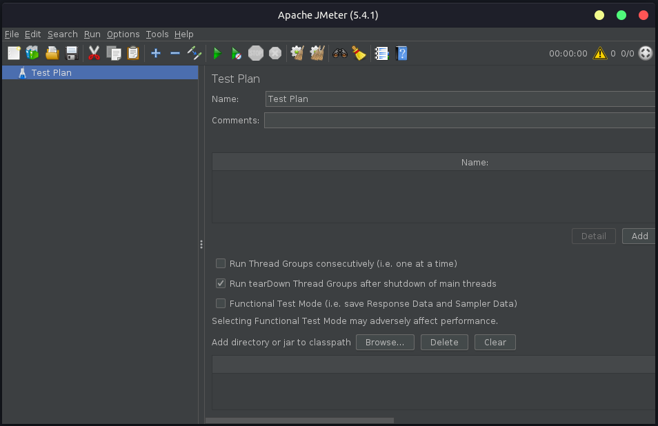

### Atividade de testes

A atividade faz parte da disciplina **Testes de Software** ministrada pela Profesora Doutora **Mirna Maia**, que consiste em desenvolver um tutorial sobre uma ferramenta de testes: <b>JMeter</b>.

<hr>

# JMeter: Testes de performance para requisições HTTP

<br />
<br />

### O que é o JMeter?

Desenvolvida em 2007 pela <a href="https://www.apache.org/" target="_blank">Apache</a>, o JMeter é uma ferramenta utilizada para a realização de testes de performance. Escrita em Java, <b>gratuita</b>, de código aberto, com o objetivo na simulação de diversos tipos de testes:

-   Teste de carga;
-   Teste de estresse;
-   Teste de escalabilidade;
-   Teste de pico;
-   Teste de resistência;
-   Teste de concorrência;
-   Teste de capacidade.<br /><br />

O <b>JMeter</b> foi desenvolvido para testar aplicações Web. No entanto, com o tempo a tecnologia foi aprimorada e já é possível utilizá-la para testes em diferentes serviços:

-   Requisições HTTP, SOAP ou FTP;
-   Bancos de dados;
-   servidores de e-mail, etc.<br /><br />

### O que é um teste de performance?

Um teste de performance analisa como uma determinada aplicação se comporta quando ela é submetida a uma carga exaustiva de requisições, indicando se existe algum problema na aplicação ou na infra estrutura de hospedagem.<br /><br />

### Download e requisitos

\* A versão do JMeter utilizada para os testes é a 5.4.1.

O devido tutorial foi desenvolvido com base em um ambiente linux, utilizando o Ubuntu na versão 18.04.5 LTS.

```bash
$ lsb_release -a
```

```
LSB Version:	core-9.20170808ubuntu1-noarch:...
Distributor ID:	Ubuntu
Description:	Ubuntu 18.04.5 LTS
Release:	18.04
Codename:	bionic
```

:exclamation: <b>Importante!</b>

Para executar o JMeter é necessário possuir a JVM instalada em seu computador, se você ainda não possui, <a href="https://jmeter.apache.org/usermanual/get-started.html#os" target="_blank">clique aqui</a> para ir para documentação. Utilizando a versão 14.

```bash
$ java -version
```

```
java version "14.0.2" 2020-07-14
Java(TM) SE Runtime Environment (build 14.0.2+12-46)
Java HotSpot(TM) 64-Bit Server VM (build 14.0.2+12-46, mixed mode, sharing)
```

👉 <a href="https://jmeter.apache.org/download_jmeter.cgi" target="_blank">Link para o download do JMeter</a><br /><br />

### JMeter: Primeiro contato

```bash
# Para abrir o programa:
$ cd apache-jmeter-5.4.1/bin/

# Em seguida:
$ ./jmeter
```

<b>Pronto!</b> Essa é a tela do JMeter na versão 5.4.1.

<br /><br />

### Como os testes irão funcionar?

Será configurada uma aplicação desenvolvida NodeJs que ficará escutando na porta 80, cuja a única finalidade consiste em: ao ser solictada uma URL, a aplicação irá inserir um registro (nome, email e cpf) em um banco de dados (Postgres).

A máquina que irá receber a aplicação será uma instância com 2 núcleos de processamento e 4gb de ram na <a href="https://aws.amazon.com/pt/" target="_blank">Amazon AWS</a>.<br /><br />

### Fonte de pesquisa

-   <a href="https://jmeter.apache.org/download_jmeter.cgi" target="_blank">Medium</a>
-   <a href="https://blog.betrybe.com/desenvolvimento-web/jmeter/" target="_blank">Betrybe</a>
-   <a href="https://dev.to/hitjethva/how-to-install-apache-jmeter-on-ubuntu-20-04-2di9" target="_blank">Dev</a><br /><br />

### Autoria do tutorial

Edivam Enéas de Almeida Júnior
